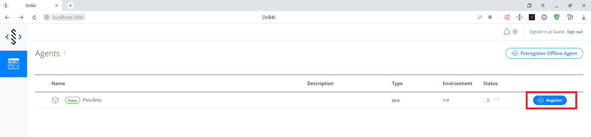
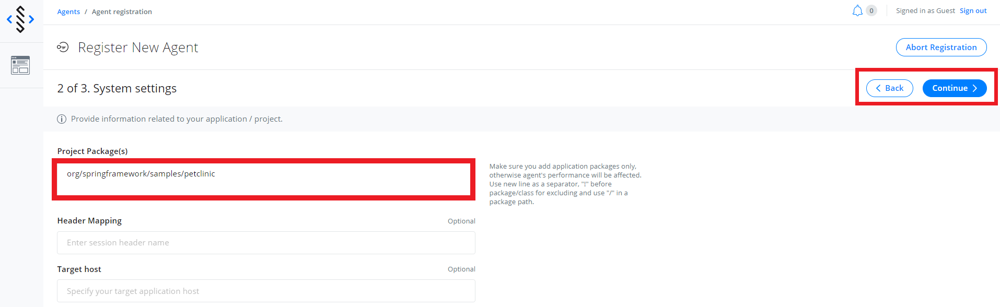
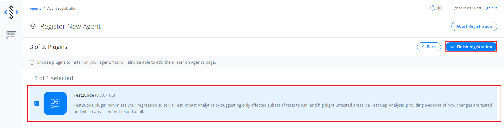

# Drill-Samples

## Table of contents
1. [Preparation env for latest versions](#Preparation-env-for-latest-versions)
2. [Common Start and register app](#Common-Start-and-register-app)
3. [Using Test2Code plugin](#Using-Test2Code-plugin)
    - [Start Autotests](#Start-Autotests)
  <!--  - [Manual Browser extension](#Manual-Browser-extension)--->

## Preparation env for latest versions

- <a href="https://www.docker.com/products/docker-desktop">Download docker</a>
- Download the latest version of drill agent for your OS
    1. <a href="https://oss.jfrog.org/artifactory/oss-release-local/com/epam/drill/drill-agent-mingwX64/">Windows</a>
    2. <a href="https://oss.jfrog.org/artifactory/oss-release-local/com/epam/drill/drill-agent-linuxX64/">Linux</a>
    3. <a href="https://oss.jfrog.org/artifactory/oss-release-local/com/epam/drill/drill-agent-macosX64/">MacOS</a>
- Unzip it
- Go to folder /maven-sample/spring-petclinic in pom.xml file set value to "pathToAgent" property


## Common Start and register app
- Launch docker
- Go to folder /admin run console and write ```docker-compose up```
- Launch  <a href="https://github.com/Drill4J/spring-petclinic">spring-petclinic</a> 
    - go to /maven-sample/spring-petclinic and write ```mvnw spring-boot:run```
    - or in idea run maven task spring-boot:run
    
- When the application is launched follow the link http://localhost:3000 and register the agent
    - Register agent 
    - Set package 
    - Add test2code plugin 
   
#### Links

- Admin UI: http://localhost:3000
- Admin Backend Swagger: http://localhost:8090

## Using Test2Code plugin

### Supported test engines

- Junit 4
- Junit 5
- Testng 
- Cucumber 
- Spoke 
- Selenium


### Start Autotests

- Go to one of autotest repositories
- In the console write ```mvnw test```
- or in idea run "test" task
<!--
### Manual Browser extension
//TODO
--->
